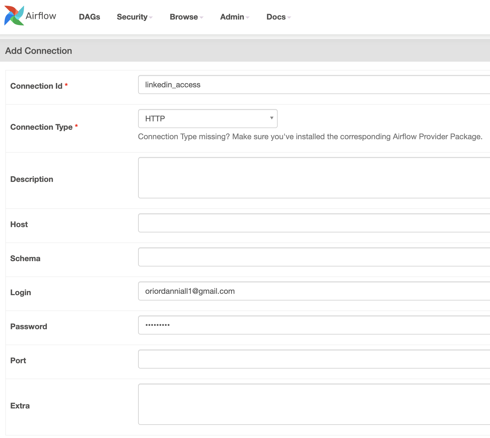

# airbyte-airflow-scraper <!-- omit in toc -->

<details open>
    <summary>Table of Contents</summary>

- [Overview](#overview)
- [Quick Start](#quick-start)
  - [TL;DR](#tldr)
  - [Initialising Environment](#initialising-environment)
    - [Set file permissions](#set-file-permissions)
    - [Create admin user and password for web authentication](#create-admin-user-and-password-for-web-authentication)
    - [Specify the Airflow Docker image](#specify-the-airflow-docker-image)
    - [Create a Fernet key for Airflow](#create-a-fernet-key-for-airflow)
  - [Initialise Airflow](#initialise-airflow)
  - [Run Airflow](#run-airflow)
- [Airflow - Airbyte Configuration](#airflow---airbyte-configuration)
  - [1. Create Airflow Connection for Linkedin](#1-create-airflow-connection-for-linkedin)
  - [2. Create Connection to AWS](#2-create-connection-to-aws)
  - [3. Create Connection to Airbyte scheduler](#3-create-connection-to-airbyte-scheduler)
- [Architecture](#architecture)
  - [Airflow](#airflow)
    - [Metadata Database - Postgres](#metadata-database---postgres)
    - [Scheduler](#scheduler)
    - [Executor](#executor)
  - [Celery](#celery)
    - [Redis - Message Broker](#redis---message-broker)
    - [Flower - Celery Monitoring Tool](#flower---celery-monitoring-tool)
- [Structure](#structure)

</details>

## Overview

The purpose of this repository is to scrape user data from Linkedin using and ingest the data into Postgres using Airbyte. Airflow is used for orchestration and scheduling.

For more details follow the Airbyte tutorial: https://airbyte.com/tutorials/data-scraping-with-airflow-and-beautiful-soup. There are some differences between this implementation and Airbyte's tutorial which can be found in the [Airflow - Airbyte Configuration](#airflow---airbyte-configuration) section.

## Quick Start

<details>
    <summary> Show/Hide Details</summary>

This guide is based off Airflow's quick start to [Running Airflow in Docker](https://airflow.apache.org/docs/apache-airflow/stable/start/docker.html)

### TL;DR

Create an `.env` file as follows:
```bash
AIRFLOW_UID=<YOUR LOCAL USER ID>
AIRFLOW_GID=<YOUR LOCAL GROUP ID>
AIRFLOW_IMAGE_NAME=<AIRFLOW DOCKER IMAGE e.g apache/airflow:2.1.2>
_AIRFLOW_WWW_USER_USERNAME=<AIRFLOW ADMIN USERNAME>
_AIRFLOW_WWW_USER_PASSWORD=<AIRFLOW ADMIN PASSWORD>
FERNET_KEY=<YOUR FERNET KEY>
```

Initialise Airflow:
```bash
docker-compose up airflow-init
```

Start all Airflow services:

```bash
docker-compose up
```

Place your dag files within [dags/](dags/) and your plugins within [plugins/](plugins/).

### Initialising Environment

#### Set file permissions

Within our [docker-compose](docker-compose.yaml) file we are mounting a number of directories i.e [config/](config/), [dags/](dags/), [logs/](logs/) and [plugins/](plugins/). To avoid issue with non matching file permissions, we need to ensure that our mounted volumes within every docker container use the native Linux filesystem user/group permissions.

To fix this we can specify the UID and GID for Airflow and pass this to our env file:
```bash
echo -e "AIRFLOW_UID=$(id -u)\nAIRFLOW_GID=0" >> .env
```


#### Create admin user and password for web authentication

Airflow 2.0 requires use of the RBAC-UI, which means users are required to specify a password prior to login.

To set the admin user, update the .env file to include values for `_AIRFLOW_WWW_USER_USERNAME` and `_AIRFLOW_WWW_USER_PASSWORD`:
```bash
#.env
_AIRFLOW_WWW_USER_USERNAME=<ADMIN USERNAME>
_AIRFLOW_WWW_USER_PASSWORD=<ADMIN PASSWORD>
```

In order to create additional users, you can use the following CLI command and you will then be prompted to enter a password for the user:

```bash
./airflow.sh airflow users create \
    --username niall.oriordan \
    --firstname Niall \
    --lastname O\'Riordan \
    --role Op \
    --email oriordn@tcd.ie
```

For more information about different roles, visit Airflow's [Access Control documentation](https://airflow.apache.org/docs/apache-airflow/stable/security/access-control.html). Additionally, more information about the `airflow users create` command can be found [here](https://airflow.apache.org/docs/apache-airflow/stable/cli-and-env-variables-ref.html#create_repeat1).

#### Specify the Airflow Docker image

Within the env file specify the airflow docker image to use:

```bash
#.env
AIRFLOW_IMAGE_NAME=<AIRFLOW DOCKER IMAGE e.g apache/airflow:2.1.2>
```

#### Create a Fernet key for Airflow

Airflow users [Fernet](https://github.com/fernet/spec/) to encrypt passwords within its connection and variable configuration.

To generate the key you will need to install [cryptography](https://pypi.org/project/cryptography/) and then run the following command:

```bash
echo -e "FERNET_KEY=$(python -c "from cryptography.fernet import Fernet; print(Fernet.generate_key().decode())")" >> .env
```

This will add the Fernet key to your `.env` file as follows:

```bash
# .env
FERNET_KEY=<YOUR FERNET KEY>
```

It is important to keep the generated fernet key safe as it is guaranteed that a password encrypted using it cannot be manipulated or read without the key.

### Initialise Airflow

It is necessary to initialise airflow by running any database migrations and creating the first admin user. This can be achieved by running:

```bash
docker-compose up airflow-init
```

After initialization is complete, the last few messages should read like below:
```bash
airflow-init_1       | Upgrades done
airflow-init_1       | Admin user airflow created
airflow-init_1       | 2.1.2
start_airflow-init_1 exited with code 0
```

### Run Airflow

To start all Airflow services run:

```bash
docker-compose up
```

After listing the running containers in another terminal you should see a similar output to the one below:

```bash
CONTAINER ID   IMAGE                  COMMAND                  CREATED              STATUS                        PORTS                                                 NAMES
b60b1cf71c84   apache/airflow:2.1.2   "/usr/bin/dumb-init …"   About a minute ago   Up About a minute (healthy)   0.0.0.0:5555->5555/tcp, :::5555->5555/tcp, 8080/tcp   airflow-docker_flower_1
cc8d0e7d4313   apache/airflow:2.1.2   "/usr/bin/dumb-init …"   About a minute ago   Up About a minute (healthy)   8080/tcp                                              airflow-docker_airflow-scheduler_1
d8dd9720bffd   apache/airflow:2.1.2   "/usr/bin/dumb-init …"   About a minute ago   Up About a minute (healthy)   8080/tcp                                              airflow-docker_airflow-worker_1
8887045f093e   apache/airflow:2.1.2   "/usr/bin/dumb-init …"   About a minute ago   Up About a minute (healthy)   0.0.0.0:8080->8080/tcp, :::8080->8080/tcp             airflow-docker_airflow-webserver_1
cf55784b4c05   postgres:13            "docker-entrypoint.s…"   About a minute ago   Up About a minute (healthy)   5432/tcp                                              airflow-docker_postgres_1
e6b51c4d2d68   redis:latest           "docker-entrypoint.s…"   About a minute ago   Up About a minute (healthy)   0.0.0.0:6379->6379/tcp, :::6379->6379/tcp             airflow-docker_redis_1
```

Note:
- It may take a few minutes for the containers to finish starting up

Place your dag files within [dags/](dags/) and your plugins within [plugins/](plugins/).

</details>

## Airflow - Airbyte Configuration

There is no need to install Python3, Airbyte, Postgres, Chrome driver or Airflow locally as this is managed by our docker-compose files: [docker-compose.airbyte.yaml](docker-compose.airbyte.yaml) and [docker-compose.airflow.yaml](docker-compose.airflow.yaml).

Once your `.env` has been created (use `example.env` as a base) as specified in the [Quick Start](quick-start) section, the only other necessary configuration is to create connections within the Airflow UI.

### 1. Create Airflow Connection for Linkedin

Provide credentials to login to Linkedin with you email and password:



### 2. Create Connection to AWS

Provide IAM credentials with access key and secret access key to save files to S3:


It is also necessary to create Airflow variables for the AWS S3 bucket and corresponding key.


### 3. Create Connection to Airbyte scheduler

Create connection to Airbyte as follows:


Note: The Airbyte webapp runs on port 8000 but the Airbyte server runs on port 8001

## Architecture

<details>
    <summary> Show/Hide Details</summary>

All applications are packaged up using `Docker` to isolate the software from its env so that it works in different development environments. We also make use of the docker compose tool to define and run multiple Docker container applications.

### [Airflow](https://airflow.apache.org/)

Airflow consists of several components:

 * `Metadata Database` - Contains information about the status of tasks, DAGs, Variables, connections, etc.
 * `Scheduler` - Reads from the Metadata database and is responsible for adding the necessary tasks to the queue
 * `Executor` - Works closely with the Scheduler to determine what resources are needed to complete the tasks as they are queued
 * `Web server` - HTTP Server provides access to DAG/task status information

#### Metadata Database - Postgres

For the Metadata Database a number of databases can be chosen. More information [here](https://airflow.apache.org/docs/apache-airflow/stable/howto/set-up-database.html).

For our purposes we have chosen a Postgres backend.

#### Scheduler

A new feature for Airflow 2.0 is the option to provide multiple schedulers. This new feature enables high availability, scalability and greater performance.

More information [here](https://airflow.apache.org/docs/apache-airflow/stable/concepts/scheduler.html).

For instance we can scale up to two schedulers by running:
```bash
docker-compose up --scale airflow-scheduler=2
```

#### Executor

Airflow provides the option for Local or Remote executors. Local executors usually run tasks inside the scheduler process, while Remote executors usually run those tasks remotely via a pool of workers.

The default executor is a Sequential Executor which runs tasks sequentially without the option for parallelism.

### [Celery](https://docs.celeryproject.org/en/stable/getting-started/introduction.html)

We have chosen the Celery Executor as our Remote Executor to scale out the number of workers.

For instance we can scale up to three celery clusters by running:
```bash
docker-compose up --scale airflow-worker=3
```

Or we could scale up to three celery clusters and two schedulers by running:
```bash
docker-compose up --scale airflow-worker=3 --scale airflow-scheduler=2
```
#### [Redis](https://redis.io/) - Message Broker

In order to use a Celery Executor a Celery backend such as RabbitMQ, Redis, etc. are required. For our purposes Redis was chosen.

Redis is a distributed in memory key value database. For Airflow it is used as a message broker by delivering messages to the celery workers.

#### [Flower](https://flower.readthedocs.io/en/latest/) - Celery Monitoring Tool

Flower is a tool used for monitoring and administering Celery clusters.

Flower is accessible on port 5555.

For example after scaling to three celery workers our Flower tool should provide a dashboard which looks as follows:


</details>

## Structure

<details>
    <summary> Show/Hide Details</summary>

- [docker-compose.yaml](docker-compose.yaml): build Airflow services
- [dags](dags/): folder for airflow dags
- [logs/](logs/): folder for airflow logs
- [plugins/](plugins/): folder for airflow plugins
- [airflow.sh](airflow.sh): convenient bash file to run Airflow CLI commands
- [airflow.cfg](config/airflow.cfg): airflow config file
- [images/](images/): images for [README](README.md)

</details>
